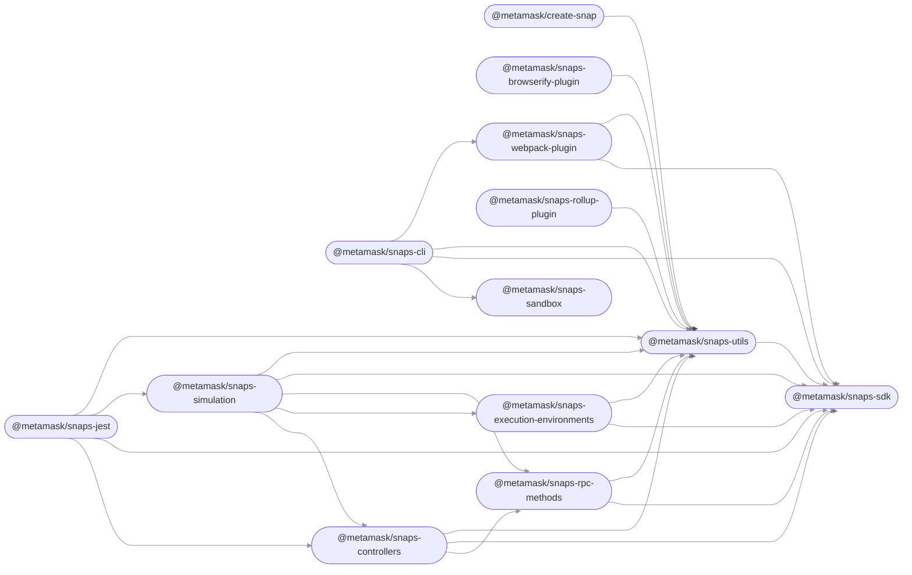

# MetaMask Snaps

Extend the functionality of MetaMask using
[MetaMask Snaps](https://metamask.io/snaps/).

## Modules

This repository contains the following packages [^fn1]:

<!-- start package list -->

- [`@metamask/create-snap`](packages/create-snap)
- [`@metamask/snaps-browserify-plugin`](packages/snaps-browserify-plugin)
- [`@metamask/snaps-cli`](packages/snaps-cli)
- [`@metamask/snaps-controllers`](packages/snaps-controllers)
- [`@metamask/snaps-execution-environments`](packages/snaps-execution-environments)
- [`@metamask/snaps-jest`](packages/snaps-jest)
- [`@metamask/snaps-rollup-plugin`](packages/snaps-rollup-plugin)
- [`@metamask/snaps-rpc-methods`](packages/snaps-rpc-methods)
- [`@metamask/snaps-sandbox`](packages/snaps-sandbox)
- [`@metamask/snaps-sdk`](packages/snaps-sdk)
- [`@metamask/snaps-simulation`](packages/snaps-simulation)
- [`@metamask/snaps-utils`](packages/snaps-utils)
- [`@metamask/snaps-webpack-plugin`](packages/snaps-webpack-plugin)

<!-- end package list -->

Or, in graph form [^fn1]:

<!-- start dependency graph -->

<!-- end dependency graph -->

Refer to individual packages for usage instructions.

## Learn more

For instructions on performing common development-related tasks, see
[contributing to the monorepo](./docs/contributing.md).

[^fn1]:
    The package list and dependency graph should be programmatically
    generated by running `yarn update-readme-content`.
