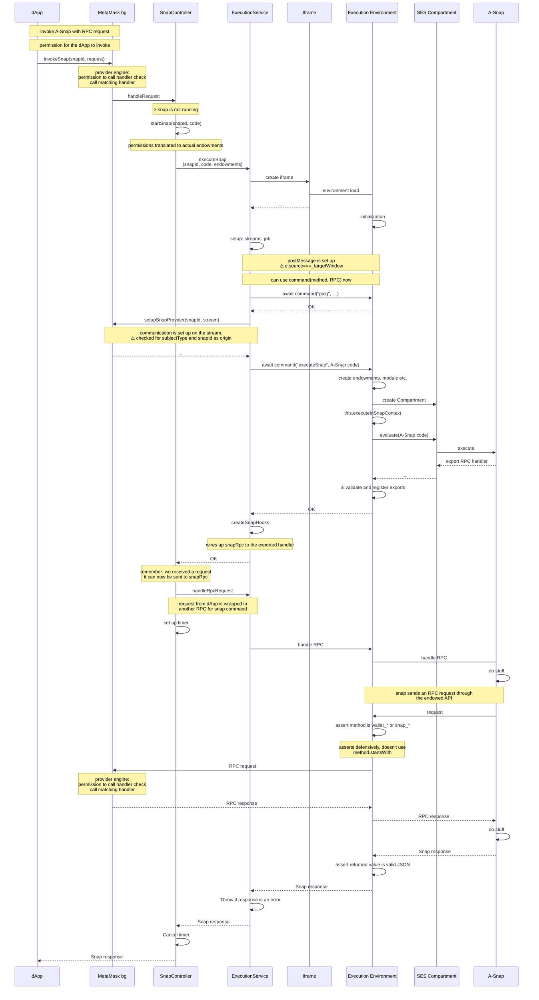

Notes marked with ⚠️ are expanded below.
The columns are organized so that everything inside of the iframe is to the right of the iframe column



## Notes

### RPC communication stringify for transport

All RPC requests are stringified in the process of passing them on, so no attacks based on poisoning methods of strings or objects should work affter the request crosses the transport gap. (eg. postMessage)

### postMessage usage in iframe execution

IframeExecutionService sets targetOrigin to `*` and
WindowPostMeassageStream says

```js
if(this._targetOrigin !== '*' ...)
```

So we're disabling the check if origin matches.
But then event.source is compared with this.\_targetWindow, which should do the trick.

- We could look into providing the right origin too

### Snap RPC connection with provider

`subjectType` is being checked before a middleware gets to handle an RPC request. The snap is going through the same permission mechanism in the provider as a dApp would.

PermissionsController is fed the snapId as origin, but the snapId is coming from

TODO: add an e2e test checking if enforcing methods not allowed for a snap works.

createOriginMiddleware.js is always overriding the origin field when it passes it onto the `req` so it's not possible for a snap to put a fake origin in the request and have it be passed onto the permissions check. (getter/setter trickery won't work since the request has been serialized to string before reaching this place.)

### Snap exports

Export validation happens while exports references are being shallow-copied onto what we return as export from snaps. (so it's not vulnerable to using a getter to bypass validations)
