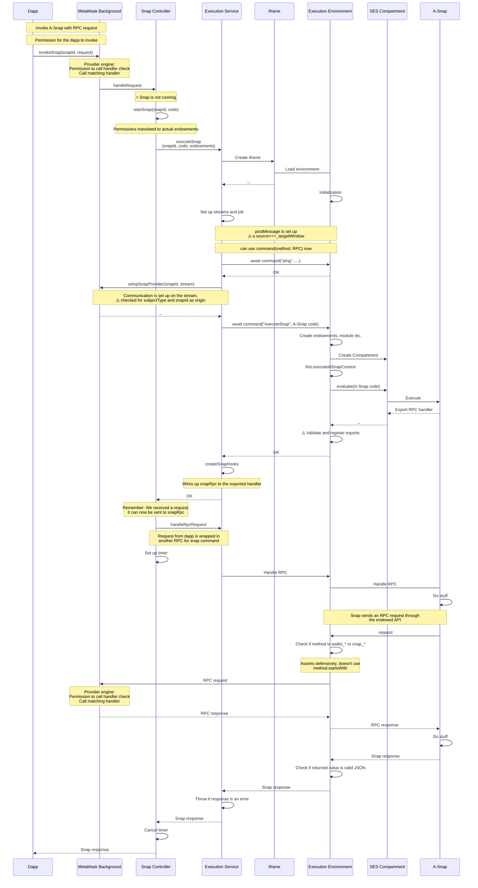

# Architecture

## Entity diagram

This entity diagram illustrates the "backend" components of the Snaps system
and how they communicate with each other.

## Sequence diagram

This sequence diagram illustrates the flow of a request from a dapp to a Snap, and back.

