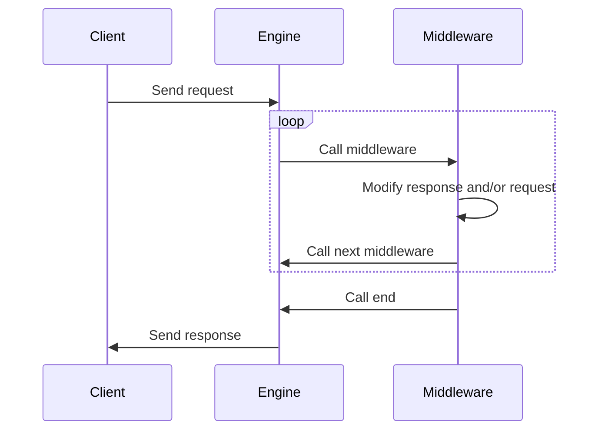

# JSON-RPC

The JSON-RPC stack is the core of the MetaMask clients. It is responsible for
handling all JSON-RPC requests from dapps, and for sending JSON-RPC requests to
the right places, depending on the request. The stack consists of the following
components:

- The JSON-RPC engine, which is the base of the stack. It receives JSON-RPC
  requests from any source, and sends them to the right handler.
- One or more middlewares, which can modify the request before it is sent to the
  handler, or handle the request themselves.

## The JSON-RPC engine

The JSON-RPC engine is the base of the JSON-RPC stack. It receives JSON-RPC
requests from any source, and sends them to the right handler. It is
implemented in the [json-rpc-engine] package.

Each connection to MetaMask creates a new instance of the engine with a
potentially unique configuration. This allows us to have different middlewares
for different connections. For example, requests from snaps are handled
differently than requests from dapps.

## Middlewares

Middlewares are functions that can modify the request before it is sent to the
handler, or handle the request themselves. They are executed in the order they
are added to the engine, **meaning the order they are added to the engine in
matters**.

A middleware function looks like this:

```ts
type Middleware = (
  request: JsonRpcRequest,
  response: JsonRpcResponse,
  next: NextFunction,
  end: EndFunction,
) => void;
```

The `request` and `response` parameters are the JSON-RPC request and response
objects, respectively. The response object is initially empty, and is passed
from middleware to middleware. Each middleware can modify both the request and
response objects before passing them to the next middleware. Since the
middlewares are executed in order, one middleware may modify the objects that
the following middlewares see.

The `next` and `end` functions are used to control the flow of the middleware
stack. If the `next` function is called, the next middleware in the stack will
be executed. If the `end` function is called, no other middleware will be
executed. The response object will be sent to the client, when the `end`
function is called.



Once all middlewares have been executed or the `end` callback has been invoked
the JSON-RPC engine will return the resulting response object. If defined, this
object should be a JSON-RPC specification result object that contains either a
`result` property or an error `property`. The engine may also return an error in
case of issues processing a request.

## JSON-RPC in MetaMask Snaps

Snaps are executed in a separate environment, and communicate with the extension
through JSON-RPC. The JSON-RPC stack for snaps is different from the JSON-RPC
stack for dapps: Snaps don't have the same capabilities as dapps, and they
shouldn't be able to access the same APIs.

[json-rpc-engine]: https://github.com/MetaMask/json-rpc-engine
